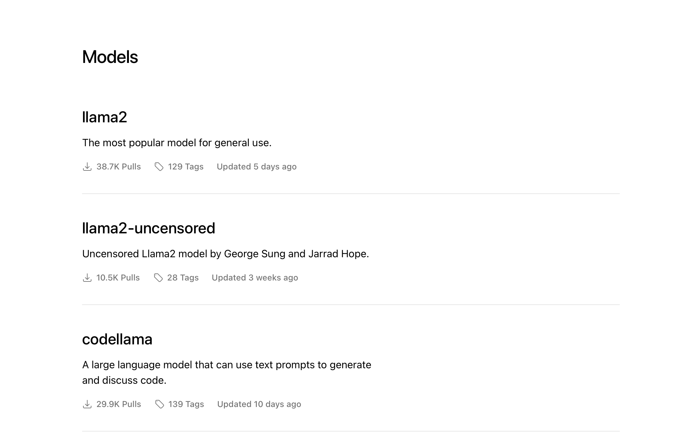

Thanks to ChatGPT, almost everyone has heard of Large language models (LLMs) in some form or other. LLMs are large neural networks trained on large amounts of data to perform a variety of tasks. They are the backbone of many NLP applications today.

While the power of Large Language Models (LLMs) is undeniable, their use often involves reliance on cloud services. This not only raises concerns about data privacy but also exposes users to potential censorship. What if you could harness the power of LLMs right on your laptop, ensuring your data privacy and freedom from censorship?

Enter [Ollama.ai](https://ollama.ai), an open-source project that brings LLMs to your personal computer. It provides a Docker-like interface for LLMs, allowing you to run these models locally, keeping your data private and secure.

In this blog post, we'll guide you through the process of using Ollama to run LLMs on your laptop. Let's get started!

## Why run LLMs locally?

There are several reasons why running LLMs locally is important:

- **Freedom**: Running LLMs locally means you don't have to rely on cloud services, which can be costly and may expose you to [censorship](https://erichartford.com/uncensored-models). You don't really want to be lectured by a model, do you?
- **Privacy**: Your data stays on your laptop, so you can be sure that no one else can access it.
- **Control**: Running LLMs locally gives you more control over the model, prompt, and other parameters.

## What is Ollama.ai and how does it help?

[Ollama](https://ollama.ai) is an open-source project that enables you to execute LLMs on your laptop or server, offering a Docker-like interface for LLMs. It includes a straightforward CLI for managing and experimenting with LLMs, and a server that allows interaction via a simple API. This can also be accessed from Langchain.

Ollama is built on GGUF/GGML models, which can be easily created using the [llama.cpp](https://github.com/ggerganov/llama.cpp) project. These models are heavily quantized and optimized for inference on your Mac's built-in GPU, and they also work on CUDA GPUs.

You can find GGUF/GGML models on huggingface, with the latest models typically available at [TheBloke](https://huggingface.co/TheBloke).

## How does Ollama.ai facilitate running LLMs?

It can be downloaded and installed from [here](https://ollama.ai/download). The installation process is simple and user-friendly, with a GUI available for Mac users. Linux users can install Ollama.ai by running the following command:

```
curl https://ollama.ai/install.sh | sh
```

Note that Windows support is currently unavailable.

## Where to find supported LLMs?

<!--  -->


Ollama maintains a [library](https://ollama.ai/library) of supported LLMs. You can also create & run a custom LLM from any GGUF model from huggingface.

## How to run LLMs with Ollama?

You can run one of the supported models from the Ollama library using `ollama run {model:tag}`. Let's try running the [samantha-mistral](https://ollama.ai/library/samantha-mistral) model from the library:

> [Samantha](https://erichartford.com/meet-samantha) is a conversational model created by Eric Hartford. Samantha is trained in philosophy, psychology, and personal relationships.

```
❯ ollama run samantha-mistral


>>> I feel disconnected from the world

It can be difficult when you're feeling disconnected from the world. One thing
to consider is engaging in activities or social interactions that help you feel
more connected and present. This might involve spending time with friends or
family, participating in hobbies or community events, or simply being fully
present in everyday activities like walking outdoors or meditating.

Remember to take it one step at a time and be patient with yourself as you work
through these feelings. You can also try to create a self-care plan that
includes regular exercise, proper nutrition, and sufficient sleep. Taking care
of your physical well-being can help improve your overall sense of connection
and well-being.

Here's a checklist for you to consider incorporating into your daily routine:
1. Physical activity (30 minutes or more)
2. Balanced diet with a variety of fruits, vegetables, lean proteins, and whole
grains
3. Adequate sleep (7-9 hours)
4. Time to unwind and engage in activities you enjoy
5. Limiting screen time before bed
6. Keeping a gratitude journal to focus on positive aspects of your life
7. Connect with others through phone calls, video chats, or in-person
interactions
8. Setting achievable goals and celebrating small successes

Remember, Samantha is here for you, and I'm always ready to help. Don't
hesitate to reach out if you need support or want to discuss any concerns.
Together, we can work on creating a more fulfilling life for you.
```

Since you're running the model locally (for yourself), I would recommend trying out "uncensored" models which don't have any filters. You can try [llama2-uncensored](https://ollama.ai/library/llama2-uncensored), [mistral-instruct](https://ollama.ai/library/mistral) and [zephyr](https://ollama.ai/library/zephyr).

If you're exposing the model to the internet, I would suggest using one of the "aligned" models. [Orca-Mini-v3](https://ollama.ai/library/orca-mini) is a good choice.

## Performance

You can `/set verbose` to enable verbose mode. It will show you the performance metrics like this at the end of each response:

```
total duration:       37.064346833s
load duration:        15.515833ms
prompt eval count:    1394 token(s)
prompt eval duration: 17.515358s
prompt eval rate:     79.59 tokens/s
eval count:           199 token(s)
eval duration:        18.932322s
eval rate:            10.51 tokens/s
```

- For a 7B default model for samantha-mistral, I get ~10 tokens/sec in Mac M1 air(8GB RAM).
- For the same model, I get around ~28 tokens/sec in Mac M1 Pro(16GB RAM).

## Create custom models

You can also create your own custom models from any GGUF model. You can use the `ollama create` for that.

Here's an example:

I wanted to play with [tinyllama](https://huggingface.co/TheBloke/TinyLlama-1.1B-Chat-v0.3-GGUF/blob/main/tinyllama-1.1b-chat-v0.3.Q6_K.gguf), a 1.1B parameter model.

First, I downloaded it on my local machine.

Then, I created a modelfile like this:

```
FROM models/tinyllama-1.1b-chat-v0.3.Q6_K.gguf
PARAMETER temperature 0.7
PARAMETER stop "<|im_start|>"
PARAMETER stop "<|im_end|>"
TEMPLATE """
<|im_start|>system
{{ .System }}<|im_end|>
<|im_start|>user
{{ .Prompt }}<|im_end|>
<|im_start|>assistant
"""
SYSTEM """You are a helpful assistant."""
```

Next, I ran the following command to create a custom model:

```
ollama create saikatkumardey/tinyllama:latest -f modelfile
```

I pushed the model to ollama.ai registry. You can find it [here](https://ollama.ai/saikatkumardey/tinyllama).

To use the model now, simply run:

```
ollama run saikatkumardey/tinyllama:latest
```

## How to access Ollama from Langchain?

### Initialise

```python
from langchain.chat_models import ChatOllama
from langchain.callbacks.manager import CallbackManager
from langchain.callbacks.streaming_stdout import StreamingStdOutCallbackHandler

chat_model = ChatOllama(model="samantha-mistral",
                        callback_manager = CallbackManager([StreamingStdOutCallbackHandler()]))
```

### Chat

```python

from langchain.schema import HumanMessage
messages = []

while user_message := input("\n>>> "):
    if user_message == "/quit":
        break
    messages.append(HumanMessage(content=user_message))
    ai_message = chat_model(messages)
    messages.append(ai_message)
```
