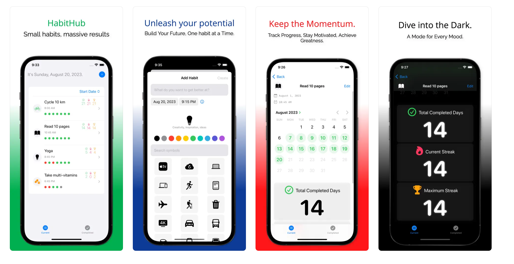
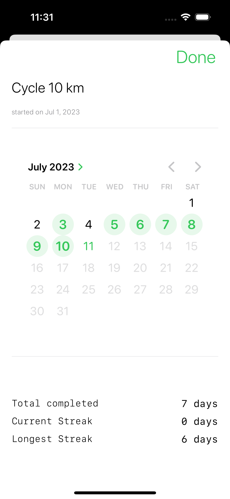
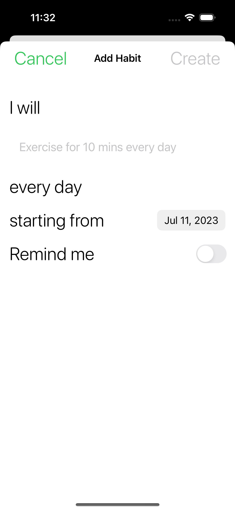
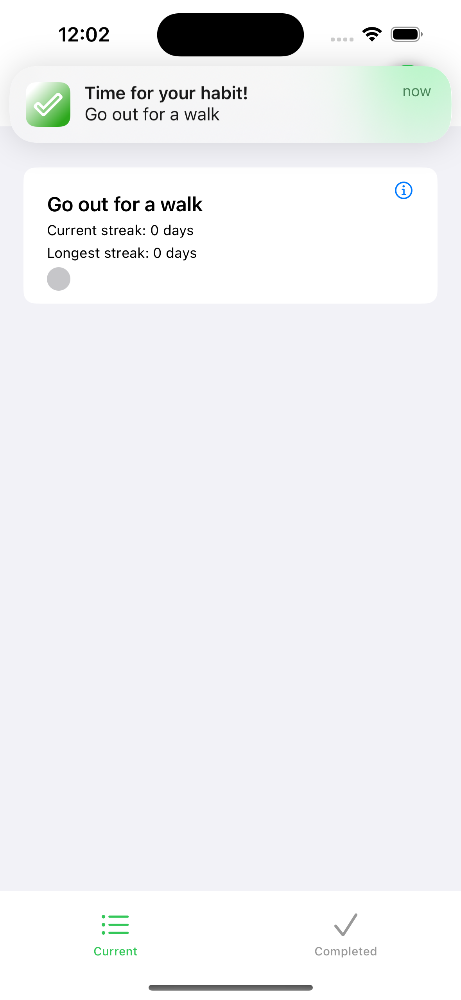

## Introduction



I recently (re)read [Atomic Habits by James Clear](https://jamesclear.com/atomic-habits) which highlights how small, consistent habits can lead to remarkable results over time. The book motivated me to be more intentional about building good habits into my routines.

I looked around at existing habit tracking apps on the App Store but couldn't find one that was simple and minimalistic enough for my needs. Many were bloated with unnecessary gamification, social sharing, subscriptions, etc.

So I decided to build a custom habit tracking app tailored exactly to my requirements:

- Track basic habit data like streaks
- Simple and clean interface
- Fast and performant
- Work offline without internet
- Store data locally on device

In addition, I wanted to learn iOS development with SwiftUI. Building this app would allow me to gain practical skills in:

- Declarative UI development with SwiftUI
- Managing state and data flow
- Persisting data locally
- Working with mobile platform APIs like notifications

To see the habit tracker app in action, check out this [demo](https://www.youtube.com/shorts/ntdg23nZyz0) and the [source code on GitHub](https://github.com/saikatkumardey/indiehabits).

In this post, I'll share how I built this habit tracking app from idea to working product using SwiftUI and other key iOS frameworks.

## Project Setup

I started by creating a new Xcode project using the SwiftUI App template. This gave me a ContentView SwiftUI file and basic app scaffolding to build on top of.

I used a TabView to divide the app into two main tabs - Current Habits and Completed Habits:

```swift
TabView {

  NavigationView {
    CurrentHabitsView()
  }
  .tabItem {
    Label("Current", systemImage: "list.bullet")
  }

  NavigationView {
    CompletedHabitsView()
  }
  .tabItem {
   Label("Completed", systemImage: "checkmark")
  }

}
```


<!--  -->

TabView renders each view in its own tab. The .tabItem modifier configures the navigation tab bar item for that view.

I added NavigationView wrappers to each screen so I could easily add navigation bars later.

For the Current Habits page, I displayed the list of habits using a SwiftUI List:

```swift
List {
  ForEach(habits) { habit in
    HabitRow(habit: habit)
  }
}
```

The List displays rows dynamically based on the habits array. ForEach loops through each habit to configure the view for that row.

This declarative paradigm makes it really easy to render views from data.

## State Management

I used SwiftUI's ObservableObject protocol to manage state across my app.

I created a HabitStore class to hold my array of habits:

```swift
class HabitStore: ObservableObject {

  @Published var habits = [Habit]()

}
```

The @Published property wrapper means any view observing the store will update when the habits array changes.

I can pass the store into views using the .environmentObject modifier:

```swift
CurrentHabitsView()
  .environmentObject(HabitStore())

```

Then access it from a child view:

```swift
@EnvironmentObject var store: HabitStore

let habits = store.habits

```

This observer pattern allows decoupling - the store doesn't know about the views using it.

Views simply observe for changes and refresh accordingly. This made managing state much easier.

## Modeling Habits



I created a Habit class to model each habit:

```swift
class Habit: Identifiable {

  var id: UUID
  var title: String
  var completedDates: [Date]

}
```

Conforming to Identifiable means SwiftUI can uniquely identify instances.

This class encapsulates all the data and behavior for a single habit:

```swift
func calculateStreak() -> Int {
  // Logic to calculate current streak
}

func isCompleted(on date: Date) -> Bool {
  // Check if completed on given date
}
```

Grouping this related logic makes the app more maintainable as it grows.

My HabitStore class acts as the main data store, holding the array of habits:

```swift
class HabitStore {

  @Published var habits = [Habit]()

}
```

Published means any views observing the store will update when the habits array changes.

By abstracting raw habit data into a domain model, I can manipulate and query habits directly through the Habit API. This provides more flexibility than working directly with arrays and dictionaries.

For example, marking a habit completed just involves:

```swift
habitStore.complete(habit)
```

Without needing direct array manipulation.

## Data Persistence

I wanted to persist habits between app launches without needing a database.

For simple data storage, I used UserDefaults:

```swift
extension UserDefaults {

  func saveHabits(_ habits: [Habit]) {
    // Encode habits
  }

  func loadHabits() -> [Habit] {
    // Decode habits
  }
}
```

UserDefaults stores key-value data, perfect for persisting small pieces of data like user preferences and app state.

My HabitStore handles loading and saving to UserDefaults:

```swift
class HabitStore {

  func loadHabits() {
    self.habits = UserDefaults.loadHabits()
  }

  func saveHabits() {
    UserDefaults.saveHabits(habits)
  }

}
```

This kept my data persistence simple while still allowing habits to be stored across launches.

For more complex data, I'd need a database. But for this basic habit data, UserDefaults provided an easy solution without that overhead.

## Handling User Input



To allow editing habits, the Add/Edit Habit views use @Binding:

```swift
struct AddHabit {

  @Binding var title: String
  @Binding var startDate: Date

}
```

@Binding creates a two-way binding to the source of truth for those properties. Updating the binding also updates the source.

When creating the view, I pass bindings to the properties I want editable:

```swift
AddHabit(title: $newHabit.title, startDate: $newHabit.startDate)
```

This avoids needing to pass callback closures up and down the view hierarchy.

For completing habits, I update the store:

```swift
func complete(_ habit: Habit) {

  habit.completed = true
  habitStore.update(habit)

}
```

Thanks to ObservableObject, any views observing the store automatically update on changes.

I also used swipe actions for quick completion:

```swift
.swipeActions {

  Button(action: {
    store.complete(habit)
  })

}
```

Making it easy to handle user input like tapping rows or swiping.

## Local Notifications



For habit reminders, I used the UserNotifications framework to schedule local notifications.

First I request notification authorization:

```swift
UNUserNotificationCenter.current().requestAuthorization(options: [.alert, .sound]) { granted, _ in

  if granted {
    // Scheduling code
  }

}
```

Then to schedule a notification:

```swift
let content = UNMutableNotificationContent()
content.title = "Habit Reminder"

let trigger = UNTimeIntervalNotificationTrigger(...)

let request = UNNotificationRequest(identifier: ..., content: content, trigger: trigger)

UNUserNotificationCenter.current().add(request)
```

When a notification is tapped, I can update the habit as completed:

```swift
func userNotificationCenter(_ center: UNUserNotificationCenter, didReceive response: UNNotificationResponse) {

  let habit = Habit(id: response.notification.request.identifier)
  habitStore.complete(habit)

}
```

The notification request identifier maps to the habit ID to update.

This allows me to build a reminders system using local notifications and update app state when a notification is received.

## Future Enhancements

While I'm happy with this initial habit tracker, there are a few minimal enhancements I have in mind:

- Progress bars to visualize habit completion rates
- Sorting and tagging habits
- Adding simple notes to habit entries
- Data export
- Share habit calendar grid

## Conclusion

Building this habit tracking app with SwiftUI was a great learning experience. Here are some key takeaways:

- SwiftUI's declarative syntax made building UI fast and intuitive. Describing views rather than imperatively constructing them took some adjusting, but proved powerful.

- ObservableObject, @Published, and @EnvironmentObject provided a clean pattern for state management. By abstracting state into a store, I avoided tight coupling between views.

- UserDefaults offered a simple persistence solution without needing a database. For more complex data, Core Data or SQLite could be used.

- The UserNotifications framework enabled scheduling reminders as local notifications. Integrating with system APIs like notifications was really handy.

- MVVM architecture with nicely encapsulated View, ViewModel, and Model layers kept the app maintainable as it grows.

While basic, this app gave me exposure to real mobile development concepts I would encounter in any professional iOS app.

## Try the App

I'd love for others to be able to use this habit tracking app and provide feedback.

<a href="https://apps.apple.com/in/app/habithub-simple-habit-tracker/id6451051983"></a>

It's open source, so feel free to check out the code on [GitHub](https://github.com/saikatkumardey/indiehabits) for the final habit tracker app.
